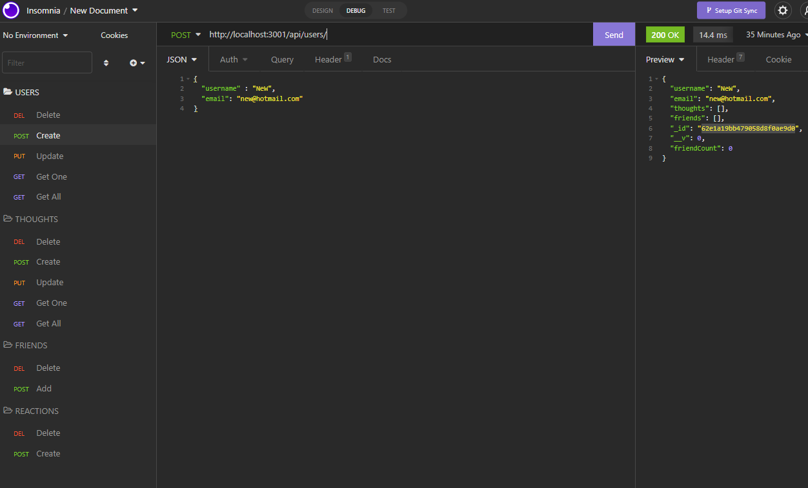

# Social-Network-API-W18

## Description

To build an API for a social network web application, where users can share their thoughts , react to friends’ thoughts and create a friend list, is a challenge. 
This Repositery uses Express.js for routing, a MongoDB database, and the Mongoose ODM. In addition to using the [Express.js](https://www.npmjs.com/package/express) and [Mongoose](https://www.npmjs.com/package/mongoose) packages. Users may also optionally use a JavaScript date library of theirs choice or the native JavaScript `Date` object to format timestamps.

No seed data is provided, so the user need to create  own data using Insomnia after he has created the API.


## Table of Contents
- [User-Story](#user-story)
- [Usage](#usage)
- [Installation](#Installation)
- [Screenshots-of-Deployment](#screenshots-of-Deployment)
- [Walkthrough-Video-Link](#walkthrough-Video-Link)
- [URL-of-GitHub-Repository](#URL-of-GitHub-Repository)


## User-Story

```md
AS A social media startup
I WANT an API for my social network that uses a NoSQL database
SO THAT my website can handle large amounts of unstructured data
```

## Usage

```md
GIVEN a social network API
WHEN I enter the command to invoke the application
THEN my server is started and the Mongoose models are synced to the MongoDB database
WHEN I open API GET routes in Insomnia for users and thoughts
THEN the data for each of these routes is displayed in a formatted JSON
WHEN I test API POST, PUT, and DELETE routes in Insomnia
THEN I am able to successfully create, update, and delete users and thoughts in my database
WHEN I test API POST and DELETE routes in Insomnia
THEN I am able to successfully create and delete reactions to thoughts and add and remove friends to a user’s friend list
```

## Installation
- node.js
- Express.js
- Mongoose
- Insomnia

## Screenshots-of-Deployment
### View from Insomnia



## Walkthrough-Video-Link
### VS Code Development
https://youtu.be/kGAIAOZrYFs

### Insomnia Development
https://youtu.be/gKpiIhXtqgo


## URL-of-GitHub-Repository
https://github.com/mattesanna017/Social-Network-API-W18